# Relatório Técnico Final Integrado

---

## Capa (requisito entrega — 9/jun/2026)

### Framework para Compiladores e Interpretadores Usando Microsserviços

**Integrantes da equipe**

| Integrante | Nome completo |
|------------|---------------|
| Bruno Gomes | ✅ |
| Alan | _[completar nome completo]_ |
| Karlisson | _[completar nome completo]_ |
| Maria | _[completar nome completo]_ |

**Código-fonte (GitHub):** https://github.com/brunog2/minipar-framework

**Vídeo da execução (opcional):** _[inserir URL do vídeo passo a passo dos testes E1--E12]_

> Atualize nomes e vídeo em [`docs/report-cover-info.md`](docs/report-cover-info.md) e [`docs/report-cover-info.tex`](docs/report-cover-info.tex) antes de `./scripts/build-pdf.sh`.

---

| | |
|---|---|
| **Instituição** | Universidade Federal de Alagoas — Instituto de Computação |
| **Curso** | Ciência da Computação |
| **Disciplinas** | Compiladores · Reuso de Software · LPS / Tópicos em Engenharia de Software |
| **Professor** | Dr. Arturo Hernandez Dominguez |
| **Versão** | MiniPar Framework 2026.1 |
| **Data** | Junho de 2026 |

> Versão Markdown espelhando [`report.tex`](report.tex). Diagramas em [`docs/figures/`](docs/figures/).  
> Gaps operacionais: [`docs/WHAT_REMAINS.md`](docs/WHAT_REMAINS.md). Validação: [`docs/VALIDATION.md`](docs/VALIDATION.md).

---

## Sumário

1. [Introdução e contexto](#1-introdução-e-contexto)
2. [Framework e instanciação de aplicações](#2-framework-e-instanciação-de-aplicações)
3. [Modelagem e compiladores](#3-modelagem-e-compiladores)
4. [Reuso de software](#4-reuso-de-software)
5. [LPS e microsserviços](#5-lps-e-microsserviços)
6. [Implementação e infraestrutura](#6-implementação-e-infraestrutura)
7. [Testes e resultados](#7-testes-e-resultados)
8. [Conclusão](#8-conclusão)
9. [Apêndices](#9-apêndices)

---

## 1. Introdução e contexto

### 1.1 Enunciado

O **MiniPar Framework 2026.1** é uma linha de produto de software (LPS) organizada em microsserviços para processar a linguagem **MiniPar 2026.1** (OO, `par`/`seq`, múltiplos back-ends). Evolui a MiniPar 2025.1 (Maciel, Rego) com arquitetura distribuída: cada fase ou variante de saída é um serviço REST autônomo, orquestrado pelo `api-gateway`.

Documentação de gestão: [`COMPLIANCE_AUDIT.md`](COMPLIANCE_AUDIT.md) · [`ROADMAP.md`](ROADMAP.md) · [`ACTIVITIES.md`](ACTIVITIES.md).

### 1.2 Objetivos

1. Suporte OO completo na gramática e AST.
2. Análise léxica, sintática e semântica como serviços HTTP.
3. Back-ends LPS (interpretador, C/C++, Rust, ARM, extensão Python) via `minipar-core`.
4. Registro de pontos de variação e variantes (LPS).

### 1.3 Framework versus gerador de aplicações

O Prof. Arturo esclareceu que a distinção central é **inversão de controle** e **extensibilidade por hotspots**, não apenas volume de código.

| Aspecto | Gerador de aplicações | MiniPar Framework |
|---------|----------------------|-------------------|
| Estrutura | Fechada; parâmetros escolhem variante | Aberta; contratos e pontos de extensão |
| Controle de fluxo | O produto gerado manda | O framework manda (Hollywood) |
| Reuso | Código independente da ferramenta | `minipar-core` permanece em runtime |
| Extensão | Só variantes previstas | Novo backend via `emit()`/`finalize()` |
| Criar instância | `createProject(params)` | Stack Docker + hotspots + registry |

Não há `createProject` no repositório. Cada “aplicação” é uma **configuração LPS** sobre o mesmo chassi.

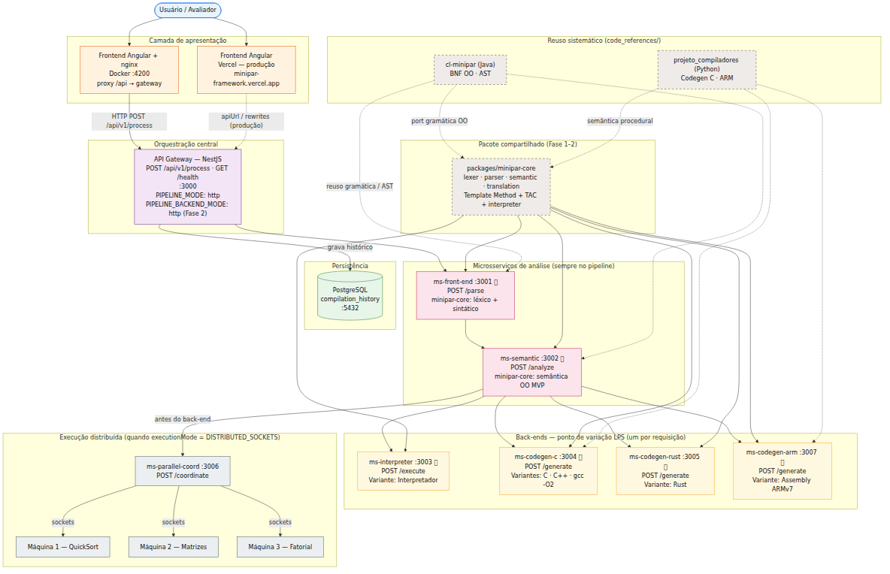

*Figura 1 — Arquitetura de microsserviços (Fases 1–3).*

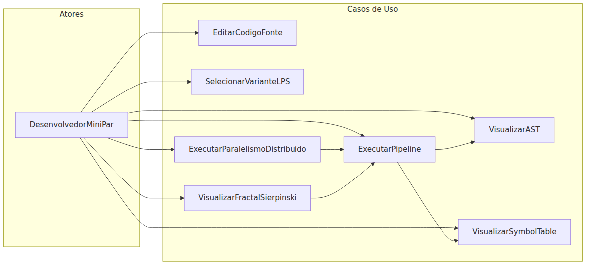

*Figura 2 — Casos de uso da interface e do pipeline.*

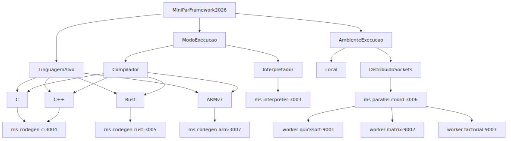

*Figura 3 — Pontos de variação: modo, back-end, ambiente.*

### 1.4 Metodologia ágil

| Fase | Período | Entregas |
|------|---------|----------|
| **Fase 1** | 2–4/jun | `minipar-core`, `ms-front-end`, `ms-semantic`, pipeline até semântica |
| **Fase 2** | 3–5/jun | Template Method, interpretador, codegen C/Rust/ARM |
| **Fase 3** | 5–7/jun | `ms-parallel-coord`, workers socket, fractal, `DISTRIBUTED_SOCKETS` |

---

## 2. Framework e instanciação de aplicações

### 2.1 Frozen-spot, hotspot e método abstrato

| Camada | O quê | Exemplo |
|--------|-------|---------|
| **Frozen-spot** | Invariante; dev não sobrescreve | `translate()`, `validate()`, pipeline gateway |
| **Método abstrato** | Contrato; assinatura fixa | `emit()`, `finalize()` |
| **Hotspot** | Corpo que o dev escreve | `CBackend.emit()` → TAC + gcc |

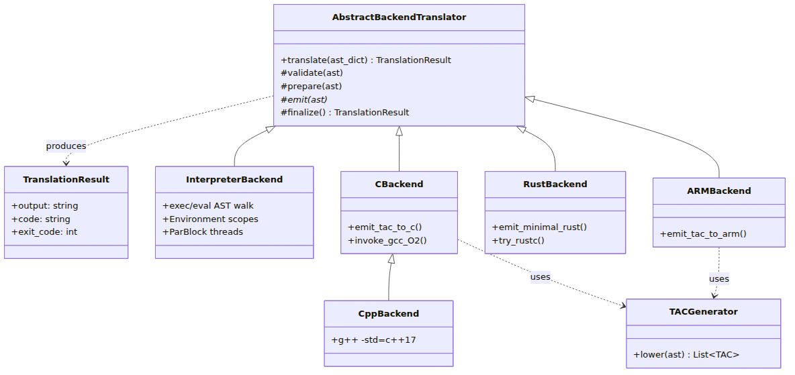

*Figura 4 — Template Method: frozen-spots e hotspots.*

### 2.2 Princípio Hollywood

O gateway orquestra; o microsserviço chama `Backend.translate()`; o esqueleto chama `emit()` no momento certo.

```typescript
// api-gateway/src/pipeline/backend-registry.ts + pipeline.service.ts
const descriptor = BACKEND_REGISTRY.find((b) => b.variability === targetVariability);
const res = await this.http.post(`${backendUrl}${descriptor.endpoint}`, payload);
```

```python
# packages/minipar-core/minipar_core/translation/base_translator.py
def translate(self, ast_dict: dict) -> TranslationResult:
    self.validate(ast_dict)
    if self._errors:
        return TranslationResult(output="; ".join(self._errors), exit_code=1)
    self.prepare(ast_dict)
    self.emit(ast_dict)      # hotspot
    return self.finalize()   # hotspot
```

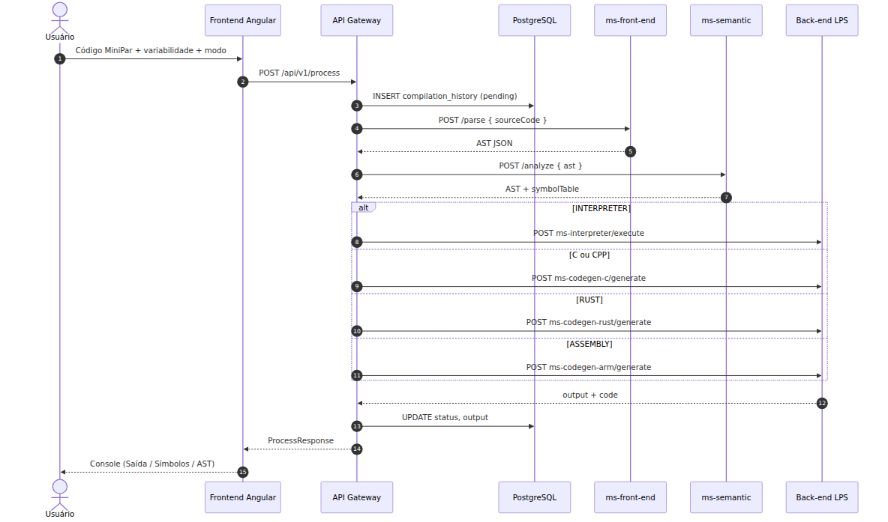

*Figura 5 — `POST /api/v1/process`: gateway → análise → back-end → `translate()`.*

### 2.3 Instâncias de referência

| Instância | Microsserviço | Hotspot | Produto |
|-----------|---------------|---------|---------|
| App A — Interpretador | `ms-interpreter` | `Interpreter.emit()` | Execução direta AST |
| App B — Compilador C | `ms-codegen-c` | `CBackend.emit()` | C + `gcc -O2` |
| App C — Python (extensão) | `ms-codegen-python` | `PythonBackend.emit()` | Python + `python3` |

Catálogo: [`applications/README.md`](applications/README.md). Guia: [`CREATING_AN_APPLICATION.md`](CREATING_AN_APPLICATION.md).

### 2.4 Frontend como cliente LPS

O Angular **não** implementa hotspots de compilação — seleciona `targetVariability` e dispara o contrato REST. Qualquer cliente HTTP pode substituir a UI.

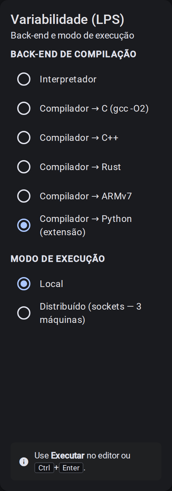

*Figura 6 — Painel LPS: back-ends incluindo extensão Python.*

### 2.5 Processo de criação de nova aplicação (6 passos)

1. Reusar chassi: `minipar-core` + gateway + `ms-front-end` + `ms-semantic`
2. Criar `MeuBackend(AbstractBackendTranslator)` a partir de [`_template_backend.py`](packages/minipar-core/minipar_core/translation/_template_backend.py)
3. Implementar `emit()` e `finalize()`
4. Criar microsserviço FastAPI (~30 linhas)
5. Registrar em `backend-registry.ts` + `.env` + `docker-compose.yml`
6. Expor variante na UI (configuração LPS)

---

## 3. Modelagem e compiladores

### 3.1 Diagrama de classes do framework

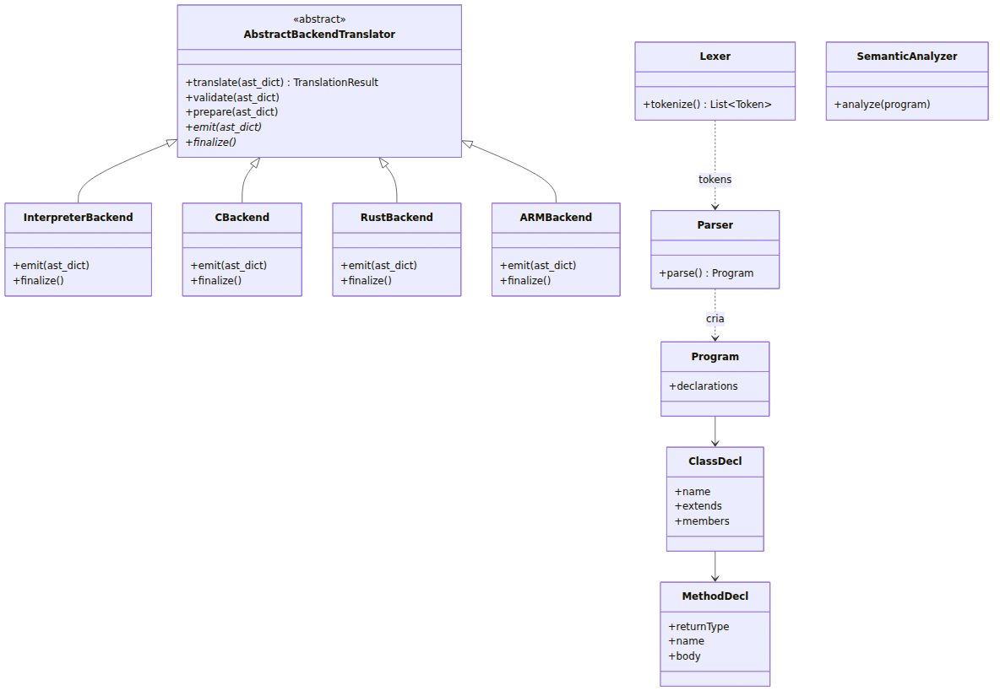

*Figura 7 — Lexer, Parser, AST, `AbstractBackendTranslator` e back-ends.*

### 3.2 BNF MiniPar 2026.1 OO (extrato)

```
<programa>      ::= { <declaracao> }
<declaracao>    ::= <classe> | <funcao> | <canal> | <stmt>
<classe>        ::= "class" ID [ "extends" ID ] "{" { <membro> } "}"
<membro>        ::= <atributo_oo> | <metodo>
<metodo>        ::= <tipo> ID "(" [ <param> { "," <param> } ] ")" <bloco>
<stmt>          ::= <bloco> | <if> | <while> | <for> | <print> | <return>
                  | "par" "{" { <stmt> } "}" | "seq" "{" { <stmt> } "}"
<instanciacao>  ::= "new" ID "(" [ <expr> { "," <expr> } ] ")"
<chamada_met>   ::= <expr> "." ID "(" [ <expr> { "," <expr> } ] ")"
```

Tokens OO: `class`, `extends`, `new`, `this`, `super`. Paralelismo: `par`, `seq`, `s_channel`, `c_channel`.

### 3.3 Fluxo léxico → sintático → semântico

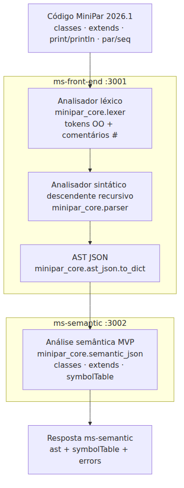

*Figura 8 — UI → gateway → parse → analyze.*

Implementação: [`lexer.py`](packages/minipar-core/minipar_core/lexer.py), [`parser.py`](packages/minipar-core/minipar_core/parser.py), [`semantic_full.py`](packages/minipar-core/minipar_core/semantic_full.py) (MS via `SemanticAnalyzer`).

### 3.4 TAC e back-end C

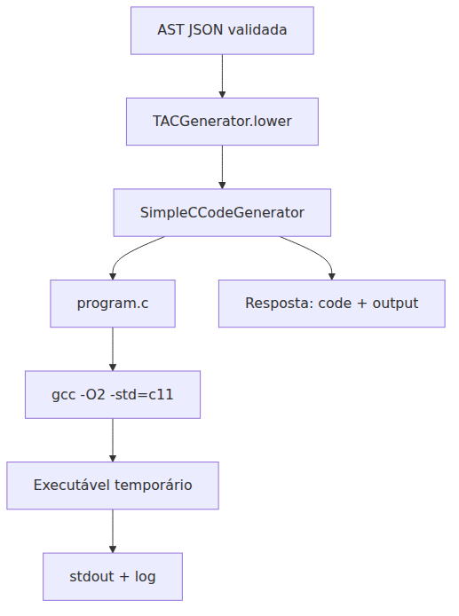

*Figura 9 — AST → TAC → C → `gcc -O2`.*

```python
# c_backend.py — hotspot
def emit(self, ast_dict: dict) -> None:
    tac = TACGenerator().lower(ast_dict)
    self._code = SimpleCCodeGenerator().generate(tac)
```

### 3.5 Back-ends

| Back-end | Hotspot | Estratégia |
|----------|---------|------------|
| Interpretador | `Interpreter.emit()` | Execução direta AST (sem TAC) |
| C / C++ | `CBackend` / `CppBackend` | TAC → C → `gcc`/`g++ -O2` |
| Rust | `RustBackend.emit()` | Emissão Rust + `rustc` (MVP) |
| ARM | `ARMBackend.emit()` | TAC → ARMv7 (MVP) |
| Python | `PythonBackend.emit()` | TAC → Python + `python3` (extensão) |

### 3.6 Paralelismo e canais na linguagem

- **`par`/`seq` local:** `exec_par` dispara **processos** filhos; IPC via broker TCP (`ChannelBroker` em `socket_channel.py`), não `multiprocessing.Queue`.
- **`s_channel` / `c_channel`:** `send`/`receive` executados no interpretador; `c_channel(host, port)` conecta workers remotos.
- **`DISTRIBUTED_SOCKETS`:** programas com `c_channel` (ex. `14_distributed_menu.minipar`) roteiam pelo interpretador; workers executam **MiniPar** (`parallel-workers/sources/*.minipar`).
- **Codegen C:** `minipar_rt.c` emite suporte a `PAR_*` e `CHANNEL_*` (compilação `gcc -O2`).

Evidência: [`docs/evidence/15_channels_socket.txt`](docs/evidence/15_channels_socket.txt), [`docs/VALIDATION.md`](docs/VALIDATION.md).

---

## 4. Reuso de software

### 4.1 Template Method (Gamma)

Variabilidade entre back-ends via `AbstractBackendTranslator`, não via `switch/case` no gateway.

### 4.2 Mapa de reuso 2025.1 → 2026.1

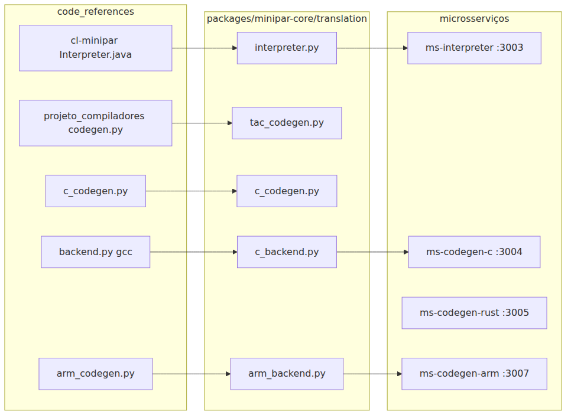

*Figura 10 — Origem (`cl-minipar`, `projeto_compiladores`) e destino (`minipar-core`).*

| Origem | Destino |
|--------|---------|
| `cl-minipar` (Lexer, Parser, AST, Interpreter) | `minipar-core` + `translation/interpreter.py` |
| `projeto_compiladores` (TAC, C, ARM) | `tac_codegen.py`, `c_backend.py`, `arm_backend.py` |

### 4.3 Componentes e OCP

- Contrato AST: [`microservices/_AST_CONTRACT.md`](microservices/_AST_CONTRACT.md)
- Registry: [`api-gateway/src/pipeline/backend-registry.ts`](api-gateway/src/pipeline/backend-registry.ts)
- Extensão: [`packages/minipar-core/EXTENDING.md`](packages/minipar-core/EXTENDING.md)

---

## 5. LPS e microsserviços

### 5.1 Binding time

| Momento | Mecanismo | Exemplo |
|---------|-----------|---------|
| Implement time | Hotspots em `translation/` | `PythonBackend.emit()` |
| Deploy time | `docker-compose.yml`, env `MS_*` | `ms-codegen-python:3008` |
| Runtime | `POST /api/v1/process` | `targetVariability: "C"` |

### 5.2 Matriz de configurações de produto

| Produto | `targetVariability` | `executionMode` |
|---------|---------------------|-----------------|
| Interpretador local | INTERPRETER | LOCAL |
| Compilador C | C | LOCAL |
| Interpretador distribuído | INTERPRETER | DISTRIBUTED_SOCKETS |
| Extensão Python | PYTHON | LOCAL |

### 5.3 Componentes UML

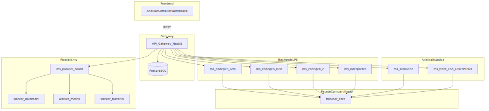

*Figura 11 — Microsserviços e gateway.*

### 5.4 Decisões documentadas

| Sugestão original | Implementação |
|-------------------|---------------|
| Gateway Spring Boot | **NestJS** |
| FeatureIDE | LPS por microsserviços + feature tree |
| Léxico e sintático separados | Unificados em `ms-front-end` |

---

## 6. Implementação e infraestrutura

### 6.1 Microsserviços

| Serviço | Rota | Porta |
|---------|------|-------|
| api-gateway | POST /api/v1/process | 3000 |
| ms-front-end | POST /parse | 3001 |
| ms-semantic | POST /analyze | 3002 |
| ms-interpreter | POST /execute | 3003 |
| ms-codegen-c | POST /generate | 3004 |
| ms-codegen-rust | POST /generate | 3005 |
| ms-parallel-coord | POST /coordinate | 3006 |
| ms-codegen-arm | POST /generate | 3007 |
| ms-codegen-python | POST /generate | 3008 |
| workers | socket | 9001–9003 |

### 6.2 Execução

```bash
cd minipar-framework
docker compose up --build
# UI: http://localhost:4200
```

Variáveis: `PIPELINE_MODE=http`, `PIPELINE_BACKEND_MODE=http`.

---

## 7. Testes e resultados

### 7.0 Validação automatizada

```bash
docker compose up --build -d
./scripts/validate-all.sh   # → docs/evidence/validation-results.json
```

**Última execução (8/jun/2026): 15/15 PASS.** Guia: [`docs/VALIDATION.md`](docs/VALIDATION.md). Conformidade: [`COMPLIANCE_AUDIT.md`](COMPLIANCE_AUDIT.md).

| ID | Teste | Status |
|----|-------|--------|
| GW | Gateway health | PASS |
| E1 | `08_interpreter_ok` | PASS |
| E7 | Erro sintático `05` | PASS |
| E2 | `09_oo_new` interpretador | PASS |
| E6 | `12_codegen_rust_stub` (`rustc`) | PASS |
| E3 | Fractal `13_sierpinski` | PASS |
| E4, E10 | Distribuído (legado + menu `14`) | PASS |
| E5, E12 | Codegen C (`11`, `09` OO) | PASS |
| E8 | Erro semântico `04` | PASS |
| E9 | Python `16` | PASS |
| E11 | Canais `15` | PASS |
| — | `GET /variants`, `/recommendations` | PASS |

### 7.1 Casos de validação

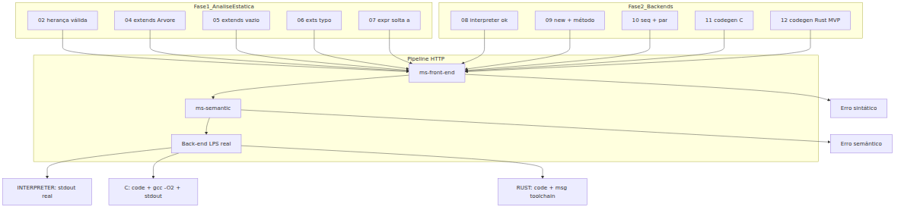

*Figura 12 — Fixtures de validação manual.*

| Arquivo | LPS | Resultado |
|---------|-----|-----------|
| `08_interpreter_ok` | INTERPRETER | Saída `ok` |
| `09_oo_new` | INTERPRETER / C | `woof` (+ `gcc -O2` em C) |
| `11_codegen_c` | C | `gcc -O2` + stdout |
| `12_codegen_rust_stub` | RUST | `rustc -O` + stdout |
| `05_parse_extends_missing` | INTERPRETER | erro de parser |
| `13_sierpinski` | INTERPRETER | matriz fractal 27×27 |
| `14_distributed_menu` | INTERPRETER + DISTRIBUTED_SOCKETS | 3 resultados worker (IP:porta) |
| `15_channels` | INTERPRETER | `42` (canais socket) |
| `16_codegen_python` | PYTHON | `hello from Python backend` |

### 7.2 Evidências visuais da UI

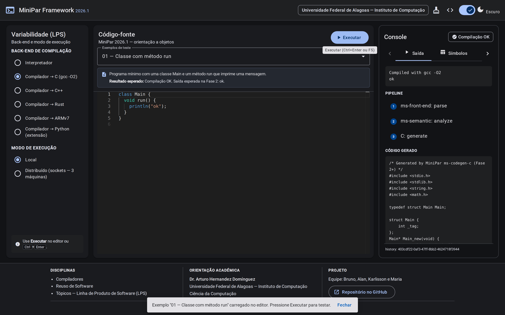

*Figura 13 — Pipeline E2E variante C.*

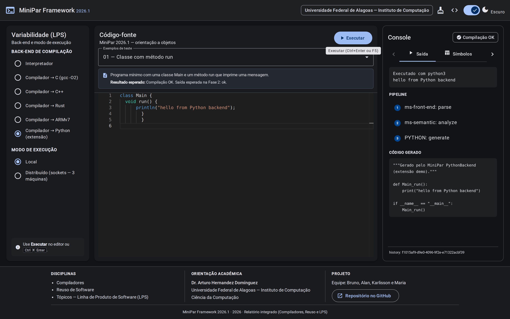

*Figura 14 — `PythonBackend`: código gerado e execução.*

### 7.3 Fractal Sierpinski

Programa: [`sources/examples/13_sierpinski.minipar`](sources/examples/13_sierpinski.minipar). Ordem 3 → matriz 27×27.

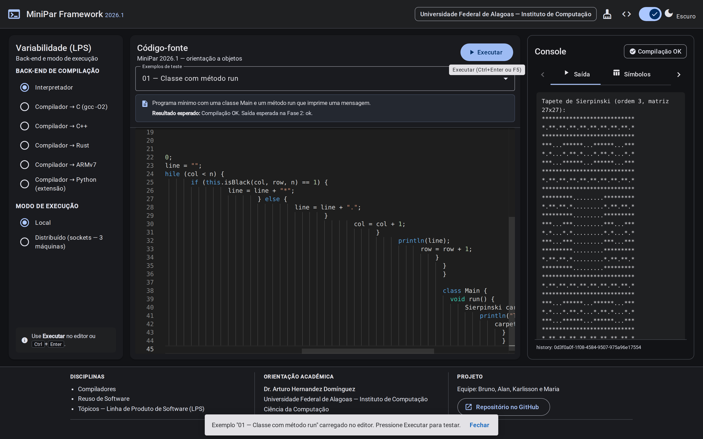

*Figura 15 — Tapete de Sierpinski no Console.*

### 7.4 Teste 3 máquinas (MiniPar nos workers)

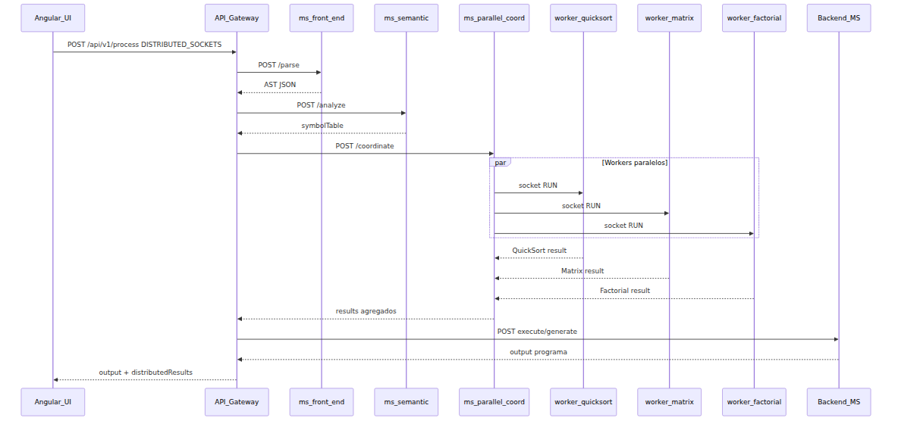

*Figura 16 — Workers socket executam programas MiniPar; menu `14_distributed_menu` usa `c_channel` + `par { receive }`.*

```bash
# Menu coordenador (recomendado)
curl -X POST http://localhost:3000/api/v1/process \
  -H "Content-Type: application/json" \
  -d "$(python3 -c "import json; print(json.dumps({'sourceCode': open('sources/examples/14_distributed_menu.minipar').read(), 'targetVariability': 'INTERPRETER', 'executionMode': 'DISTRIBUTED_SOCKETS'}))")"

# Modo legado (sem c_channel no fonte)
curl -X POST http://localhost:3000/api/v1/process \
  -H "Content-Type: application/json" \
  -d '{"sourceCode":"class Main { void run() { println(\"ok\"); } }",
       "targetVariability":"INTERPRETER","executionMode":"DISTRIBUTED_SOCKETS"}'
```

Workers: `worker-quicksort` (9001), `worker-matrix` (9002), `worker-factorial` (9003) — fontes em `microservices/parallel-workers/sources/`.

---

## 8. Conclusão

O **MiniPar Framework 2026.1** integra Compiladores, Reuso e LPS: pipeline OO em microsserviços, Template Method com seis back-ends, variabilidade na UI e extensão Python demonstrando instanciação sem alterar frozen-spots.

### Resposta à crítica “gerador versus framework”

O projeto **é um framework**: `translate()` e o pipeline são invariantes; hotspots estão em `c_backend.py`, `interpreter.py`, `python_backend.py`, etc. A equipe preencheu instâncias de referência; `PythonBackend` prova extensão por terceiros.

### Limitações (trabalho futuro)

- Hotspots formais lexer/parser alternativos (autômatos, bottom-up).
- Codegen Rust/ARM sem `minipar_rt` completo.
- Topologia Docker (3 containers) em vez de 3 PCs físicos — equivalente lógico para demo.

### Links

- Repositório: https://github.com/brunog2/minipar-framework
- UI demo: https://minipar-framework.vercel.app/
- Roteiro banca: [`docs/BANCA_NARRATIVE.md`](docs/BANCA_NARRATIVE.md)

---

## 9. Apêndices

### A. Contrato AST JSON

Raiz: `{ "type": "Program", "declarations": [...] }`. Detalhes: [`microservices/_AST_CONTRACT.md`](microservices/_AST_CONTRACT.md).

### B. Guia de instanciação

[`CREATING_AN_APPLICATION.md`](CREATING_AN_APPLICATION.md) — 6 passos, FAQ, mapa framework vs instância.

### C. Checklist E2E

Validação automatizada: `./scripts/validate-all.sh` (**15/15 PASS**, 8/jun/2026). Conformidade: [`COMPLIANCE_AUDIT.md`](COMPLIANCE_AUDIT.md).

- [x] `docker compose up --build`
- [x] `POST /api/v1/process` — INTERPRETER, C, RUST, ASSEMBLY, PYTHON
- [x] Fixtures `01`–`16` (incl. `14` menu, `15` canais)
- [x] `DISTRIBUTED_SOCKETS` + workers MiniPar
- [x] Fractal `13_sierpinski`
- [x] Extensão Python `16_codegen_python`
- [x] `GET /api/v1/variants` e `/recommendations`

Ver [`docs/VALIDATION.md`](docs/VALIDATION.md).

### D. Glossário

| Termo | Definição |
|-------|-----------|
| **Frozen-spot** | Código invariante do framework |
| **Hotspot** | Implementação específica do dev (`emit`, `finalize`) |
| **Instância** | Configuração LPS (stack + hotspots + registry) |
| **Variante LPS** | Valor de `targetVariability` |

### E. Conformidade e pendências

Matriz completa: [`COMPLIANCE_AUDIT.md`](COMPLIANCE_AUDIT.md) (regenerada em 8/jun/2026, pós **15/15 PASS**).

| Situação | Itens principais |
|----------|------------------|
| ✅ Conforme | Pipeline OO, E1–E12, canais socket, workers MiniPar, Template Method, LPS |
| 🟡 Parcial | Tipagem semântica MVP; ARM; 3 containers; PDF/vídeo operacionais |
| ❌ Não conforme | FeatureIDE; CI pytest |

Pendências operacionais: [`docs/WHAT_REMAINS.md`](docs/WHAT_REMAINS.md).

### F. Geração de PDF

```bash
./scripts/clean.sh          # remove artefatos LaTeX, dist/, __pycache__, etc.
./scripts/build-pdf.sh      # report.pdf + report-md.pdf + overleaf-report.zip
```

---

## Referências

1. Maciel, E. *MiniPar 2025.1* — `cl-minipar`, UFAL, 2025.
2. Rego, H. *Projeto compiladores MiniPar* — `projeto_compiladores`, UFAL, 2025.
3. Hernandez Dominguez, A. *Especificação MiniPar Framework 2026.1*, UFAL, 2026.1.
4. Pohl, K.; Böckle, G.; van der Linden, F. *Software Product Line Engineering*. Springer, 2010.
5. Sommerville, I. *Software Engineering*. 10ª ed. Pearson, 2016.
6. Gamma, E. et al. *Design Patterns*. Addison-Wesley, 1995.

---

*Complemento ao PDF (`report.tex`). Gerar PDFs: `./scripts/build-pdf.sh` · Overleaf: `./scripts/package-overleaf.sh`.*
